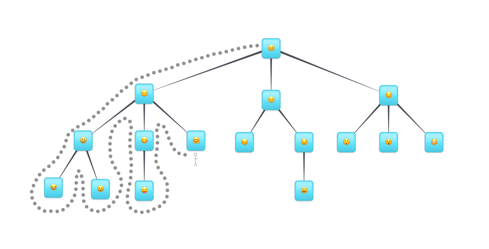

## Breadth first search traversal

- Start with the root node.
- Then move onto the root's children.
- Then move onto those node's children.

Breadth first traversal will always visit the nodes closest to the root node before moving on to the nodes that are farther away.

## Depth first search traversal
We will always be trying to visit the leaf nodes first.

Imagine a person walking around the trees.

For depth first traversal, we're going to take advantage of the recursive nature of the tree and write a recursive algorithm.

Traverse tree:

- Visit the root node of the tree.
- Get the first unvisited child sub-tree of the current node.
- Do step 1 with the sub-tree.

***
### Depth first traversals

- `<root><left><right>`: Pre-order: Data first, then left subtree then right subtree. Look at example above.
- `<left><root><right>`: In-order: Left subtree first, then data, then right subtree
- `<left><right><root>`: Post-order: Left subtree, then right subtree, then data